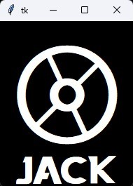
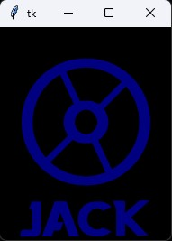

# Voice Assistant Project

## Purpose
I've wanted a way to modify [Bixby's](https://www.samsung.com/us/apps/bixby/) (or [Siri's](https://www.apple.com/siri/) or [Alexa's](https://play.google.com/store/apps/details?id=com.amazon.dee.app&hl=en_US&gl=US)) voice for a long time, but can't seem to find any apps that do so. Being a Star Wars fan, I always enjoy listening to the R2 units' responses to commands, especially R4-P17 from [Star Wars: Attack of the Clones](https://www.youtube.com/watch?v=dTFWEHW_REs). For fun, I decided to create a Python voice assistant that would play an R2 unit's response instead of a typical voice in response to my commands.

## NOTE
I own none of the Star Wars sound effects nor the Thiaga Demo Font.

This project is **not** to be used for commercial or entrepreneurial purposes. It is designed solely for learning Python and for the author's personal use.

### References
1. [Intelligent Voice Assistant in Python](https://www.youtube.com/watch?v=SXsyLdKkKX0&list=PL7yh-TELLS1G9mmnBN3ZSY8hYgJ5kBOg-&index=13)
2. [R4-P17 Voice (1)](https://www.youtube.com/watch?v=dTFWEHW_REs)
3. [R4-P17 Voice (2)](https://www.youtube.com/watch?v=4cejt0-UtOU)
4. [R4-P17 Voice (3)](https://www.youtube.com/watch?v=ehNJ-sULpsM)
5. [Thiaga Demo Font](https://github.com/Android-JCPP-Servo/voice_assistant_project/blob/main/thiaga-font/misc/DEMO%20-%20PERSONAL%20USE%20ONLY.txt)

### Photos

